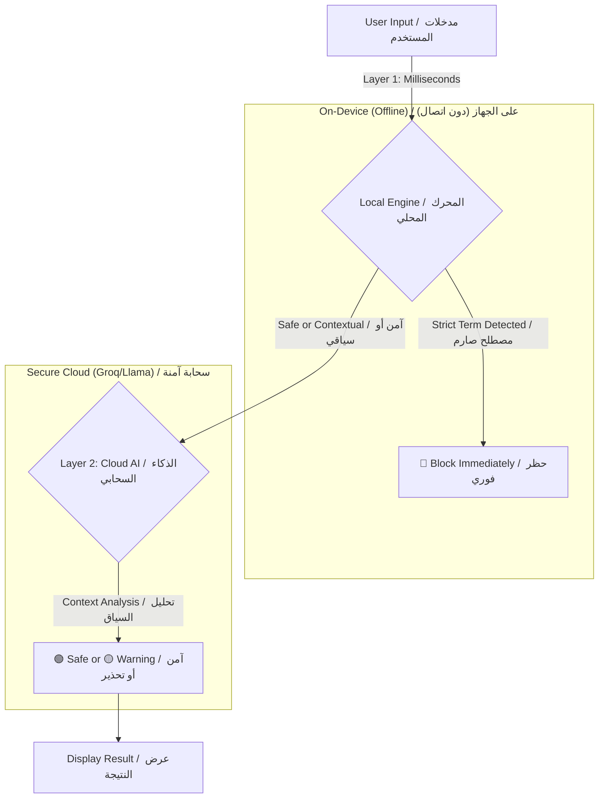

# 🛡️ Kashef | كاشف

<div align="center">
  
  <br>
  <h3><b>The AI-Powered Digital Shield for Syrian Content</b></h3>
  <h3><b>درعك الرقمي الذكي لحماية المحتوى السوري</b></h3>
</div>

<div align="center">


</div>

---

## 📖 About The Project | عن المشروع

**[English]**
**Kashef** is not just a spell-checker; it is a specialized **AI-driven Compliance Engine** designed specifically for the Syrian digital landscape. In an era of aggressive algorithmic censorship, Syrian users often face unjust bans for using common dialect terms or reporting news. Kashef acts as a pre-posting filter, using a **Hybrid AI Architecture** to distinguish between harmful content (Strict Ban) and innocent context (Reporting/News).

> **Mission:** To protect the digital expression of Syrians from algorithmic bias by providing a smart tool that differentiates between "violating content" and "contextual speech."

**[العربية]**
**كاشف** ليس مجرد مدقق إملائي؛ إنه **محرك توافق مدعوم بالذكاء الاصطناعي** مصمم خصيصاً للمشهد الرقمي السوري. في عصر الرقابة الخوارزمية الشديدة، يواجه المستخدمون السوريون حظراً غير عادل بسبب استخدام مصطلحات عامية شائعة أو نقل الأخبار. يعمل كاشف كفلتر ما قبل النشر، مستخدماً **بنية ذكاء اصطناعي هجينة** للتمييز بين المحتوى الضار (حظر صارم) والسياق البريء (نقل أخبار/تقارير).

> **الرسالة:** حماية حرية التعبير الرقمي للسوريين من الانحياز الخوارزمي، عبر توفير أداة ذكية تميز بين "المحتوى المخالف" و"سياق الكلام".

---

## ✨ Key Features | المزايا الرئيسية

| Feature | Description | الميزة | الوصف |
| :--- | :--- | :--- | :--- |
| **🛡️ Hybrid AI Core** | Combines an instant, offline **Local Filter** (Layer 1) with advanced **Cloud AI** (Layer 2) for contextual understanding. | **نواة ذكاء اصطناعي هجين** | تجمع بين **فلتر محلي** فوري (طبقة 1) و **ذكاء اصطناعي سحابي** متقدم (طبقة 2) لفهم السياق. |
| **👻 Data Amnesia** | **Privacy by Design.** Analyzed text and results are stored in RAM only and vanish instantly when the app is closed. No history, no traces. | **فقدان الذاكرة للبيانات** | **الخصوصية من التصميم.** يتم تخزين النصوص المحللة والنتائج في الذاكرة المؤقتة (RAM) فقط وتختفي فور إغلاق التطبيق. لا سجل، لا آثار. |
| **🇸🇾 Syrian-Specialized** | Trained on a massive dataset of Syrian slang, political terms, and social context, including variations and Arabizi. | **متخصص بالشأن السوري** | مدرب على مجموعة بيانات ضخمة من العامية السورية، المصطلحات السياسية، والسياق الاجتماعي، بما في ذلك الاشتقاقات والـ Arabizi. |
| **⚡ Real-time Analysis** | Provides instant feedback on your text severity as you type. | **تحليل في الوقت الفعلي** | يوفر تغذية راجعة فورية حول خطورة النص أثناء الكتابة. |

---

## 🏗️ System Architecture | المعمارية التقنية

**[English]**
Kashef utilizes a **Dual-Layer Analysis System** to balance speed, privacy, and accuracy.

**[العربية]**
يستخدم كاشف **نظام تحليل ثنائي الطبقة** للموازنة بين السرعة، الخصوصية، والدقة.



---

## 🏭 The Data Factory (Behind the Scenes) | مصنع البيانات (خلف الكواليس)

**[English]**
What makes Kashef unique is its backend **Data Factory** located in `tools/data_factory/`. This Python pipeline engineers the blocklist instead of just guessing words.

* **Policy Extraction:** Uses AI to reverse-engineer official Community Standards from platforms like Facebook & X.
* **Nuclear Injection:** Starts with a massive seed of 300+ base Syrian terms.
* **Local LLM Expansion:** Utilizes a local **Ollama (Llama 3)** instance to generate thousands of morphological variations and classify them as `STRICT` or `CONTEXTUAL`.

**[العربية]**
ما يميز كاشف هو **مصنع البيانات** الخلفي الموجود في `tools/data_factory/`. هذا المسار البرمجي (Python pipeline) يقوم بهندسة قائمة الحظر بدلاً من مجرد تخمين الكلمات.

* **استخراج السياسات:** يستخدم الذكاء الاصطناعي للهندسة العكسية لمعايير المجتمع الرسمية من منصات مثل فيسبوك و X.
* **الحقن النووي:** يبدأ ببذرة ضخمة تحتوي على أكثر من 300 مصطلح سوري أساسي.
* **التوسع المحلي (LLM):** يستخدم مثيل **Ollama (Llama 3)** محلي لتوليد آلاف الاشتقاقات الصرفية وتصنيفها كـ `صارمة` أو `سياقية`.

---

## 🚀 Getting Started |เริ่มต้นใช้งาน

### Prerequisites | المتطلبات الأساسية

* Flutter SDK `3.x`
* Dart `3.x`
* An API Key from [Groq](https://groq.com/) (for Cloud Analysis).

### Installation | التثبيت

1. **Clone the Repository | استنسخ المستودع**
```bash
git clone https://github.com/yourusername/kashef.git
cd kashef

```


2. **Secure Setup | الإعداد الآمن**
Create a `.env` file in the root directory and add your Groq API Key. **Do not commit this file.**
أنشئ ملف `.env` في المجلد الجذري وأضف مفتاح Groq API الخاص بك. **لا تقم برفع هذا الملف.**
```env
GROQ_API_KEY=your_api_key_here

```


3. **Run the App | تشغيل التطبيق**
```bash
flutter pub get
flutter run

```


4. **Production Build (Obfuscated) | بناء النسخة النهائية (المشوشة)**
To protect the codebase and wordlist from reverse engineering:
لحماية الكود وقائمة الكلمات من الهندسة العكسية:
```bash
flutter build apk --obfuscate --split-debug-info=./debug-info --release

```


---

## 🔒 Security & Privacy | الأمن والخصوصية

**[English]**
Security is paramount for Kashef. We have implemented multiple layers of protection:

* **API Protection:** Keys are stored securely in `.env` and never hardcoded.
* **Code Obfuscation:** Production builds are obfuscated to prevent decompilation and theft of the blocklist.
* **Minimal Permissions:** The app requests only essential permissions (Internet). No access to location, microphone, or contacts.
* **Secure Network:** Forces HTTPS for all network traffic.

**[العربية]**
الأمن هو الأولوية القصوى لكاشف. لقد قمنا بتنفيذ طبقات متعددة من الحماية:

* **حماية API:** يتم تخزين المفاتيح بشكل آمن في `.env` ولا يتم كتابتها في الكود مباشرة أبداً.
* **تشويش الكود:** يتم تشويش النسخ النهائية لمنع فك التجميع وسرقة قائمة الحظر.
* **صلاحيات دنيا:** يطلب التطبيق الصلاحيات الأساسية فقط (الإنترنت). لا وصول للموقع، الميكروفون، أو جهات الاتصال.
* **شبكة آمنة:** يفرض استخدام HTTPS لجميع حركات الشبكة.

---

## 📸 Screenshots | لقطات الشاشة

| Home Scanner / فاحص الرئيسية | Real-time Analysis / تحليل فوري | Settings & Privacy / الإعدادات والخصوصية |
| --- | --- | --- |
|  |  |  |

*(Note: Please update the `assets/screenshots/` folder with actual app screenshots.)*
*(ملاحظة: يرجى تحديث مجلد `assets/screenshots/` بلقطات شاشة حقيقية للتطبيق.)*

---

## 🤝 Contributing | المساهمة

**[English]**
Contributions are welcome! If you want to improve the Syrian Slang Dataset, please submit a Pull Request to the `tools/data_factory/` directory.

**[العربية]**
المساهمات مرحب بها! إذا كنت ترغب في تحسين مجموعة بيانات العامية السورية، يرجى تقديم طلب سحب (Pull Request) إلى مجلد `tools/data_factory/`.

---

## 📄 License | الترخيص

This project is licensed under the **MIT License** - see the [LICENSE](https://www.google.com/search?q=LICENSE) file for details.
هذا المشروع مرخص بموجب **رخصة MIT** - راجع ملف [LICENSE](https://www.google.com/search?q=LICENSE) للتفاصيل.

---

<div align="center">
<p>Made with ❤️ and 🛡️ for a safer digital space.</p>
<p>صُنع بـ ❤️ و 🛡️ من أجل فضاء رقمي أكثر أماناً.</p>
</div>
